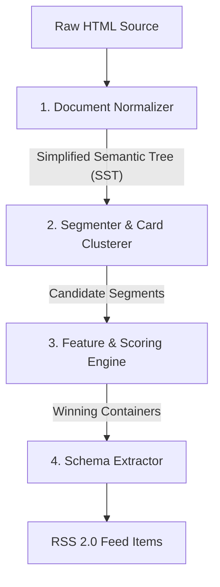

# System Architecture Review: html2rss Auto-Sourcing

This document analyzes the current heuristics-based approach used in `html2rss` for auto-sourcing feeds, identifies symptoms of structural friction, and proposes a clean-slate architecture designed for robustness, performance, and maintainability.

---

## 1. Symptoms of the Current Architectural Limitations

The current implementation uses a **proactive, bottom-up heuristic traversal** (climbing parents from leaf nodes, clustering classes, and guessing container bounds). While highly optimized for memory/wall-time in Ruby, it suffers from structural complexity symptoms:

### A. Temporal Coupling of Representation & Traversal
- **Symptom**: Low-level DOM traversals (like parent climbing, ancestor ignoring, and descendant matching) are interspersed throughout high-level business logic.
- **Consequence**: The business logic is deeply coupled to Nokogiri's specific C-backed DOM tree API. Any changes to parsing constraints require manual tracking of node references, memoization caches (`compare_by_identity`), and custom traversal loops.

### B. Heuristic Specialization Bloat ("Rules Hell")
- **Symptom**: The scraper is full of hardcoded string matching and regular expressions (e.g. tracking kickers, pre-titles, utility paths, junk classes, and localized word exclusions).
- **Consequence**: As the engine scales to support more sites, these patterns grow. Fixing extraction for Site A can easily cause a regression in Site B's ranking score.

### C. Graph Complexity and Performance Hotspots
- **Symptom**: Finding relationships between nodes (such as ancestor-descendant queries) deteriorates to $O(N^2)$ traversal paths on deep DOMs without strict caching layers.
- **Consequence**: Code is forced to maintain manual inline caches and custom performance-tuned helpers (`HtmlNavigator.descendant_of?`, `HtmlExtractor.ignored_container_path?`) to prevent CPU exhaustion.

---

## 2. The Clean-Slate Architectural Solution

To build this system correctly from the ground up, we should decouple DOM representation from content scoring and schema extraction. A robust architecture follows a **Three-Tier Pipeline**:

### Tier 1: The Document Normalizer (SST)
Instead of feeding the raw DOM tree directly to the scraper, normalize the HTML into a **Simplified Semantic Tree (SST)**.
- **Action**: Strip out all interactive layouts, script blocks, navigation panels, hidden elements, and style classes.
- **Output**: A lightweight, immutable tree of simple nodes containing only semantic markers (headings, paragraphs, media sources, links) and normalized visual characteristics (block layout, inline text).

### Tier 2: The Segmenter (Card Clustering)
Rather than traversing upwards from anchors, use a **Top-Down Document Segmentation** algorithm (similar to VIPS - Vision-based Page Segmentation).
- **Action**: Scan the SST from the body downwards to identify blocks that have repeating structure or high structural similarity.
- **Benefit**: This cleanly isolates repeated layout grids (like articles, cards, or list items) from header/footer wrapper noise.

### Tier 3: Feature-Based Scoring Engine
Instead of nested conditional rules, treat scoring as a **Declarative Feature Matrix**:
1. Define a set of pure, independent **Feature Evaluators**:
   - `TextDensityFeature`: Ratio of plain text words to link nodes.
   - `ImagePresenceFeature`: Presence of media or cover imagery.
   - `DateProximityFeature`: Presence of timestamp-like tags nearby.
   - `HeadingAnchorMatchFeature`: Link anchors that match heading titles.
2. The Scoring Engine runs these features over the candidate segments and computes a weighted composite score. This decouples the "measurement" of a DOM segment from the "policy" of selecting a winner.

---

## 3. Implementation Comparison

| Attribute | Current Architecture | Proposed Clean Architecture |
| :--- | :--- | :--- |
| **Data Flow** | Imperative climbing / clustering | Unidirectional normalization -> scoring -> extraction |
| **Logic Type** | Hard-coded heuristics | Declarative feature scores |
| **Extensibility** | High risk of regression across sites | Low risk; adjust feature weights or add new evaluators |
| **DOM Dependency** | Bound directly to Nokogiri nodes | Bound to an abstract SST (easy to test and mock) |
| **Performance** | Managed via inline identity caches | Guaranteed fast via simplified, shallow trees |
